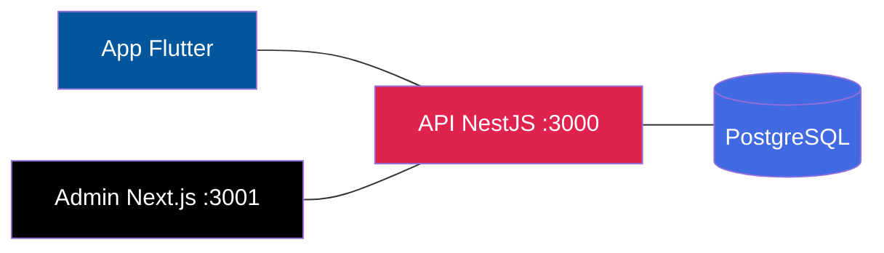

# LoopClub Enterprise

> Plataforma SaaS multiempresa de fidelização e retenção de clientes.

<p>
  <picture>
    <source media="(prefers-color-scheme: dark)" srcset="https://via.placeholder.com/800x40/1a1a2e/ffffff?text=">
    
  </picture>
</p>


**LoopClub** oferece um aplicativo único para clientes acumularem pontos e trocarem por recompensas, enquanto empresas gerenciam seus programas de fidelidade por um painel web centralizado. Uma única base de código para clientes, funcionários, empresas e administração master.

> :warning: Projeto em desenvolvimento ativo. Consulte [STATUS.md](docs/STATUS.md) para saber o que está funcionando e o que ainda está por vir.

---

## Stack

| Camada | Tecnologia |
|---|---|
| Mobile | Flutter — Android e iOS |
| Backend | NestJS + TypeScript |
| ORM | Prisma |
| Banco | PostgreSQL 16 |
| Admin | Next.js |
| API | REST + Swagger / OpenAPI |
| Versionamento | Git + GitHub |
| Infra | Docker (PostgreSQL) |

---

## Preview do produto

Abaixo, o que existe hoje em cada frente do produto.

### Mobile — App do cliente

```
┌──────────────────────────┐
│   ●  LoopClub            │
│                          │
│   A plataforma que faz    │
│   seus clientes voltarem. │
│                          │
│   ┌────────────────────┐ │
│   │     Começar        │ │
│   └────────────────────┘ │
└──────────────────────────┘
Splash screen com gradiente
```

```
┌──────────────────────────┐
│  ←  Minha carteira       │
│                          │
│  Olá, Nicholas 👋        │
│  Seus cartões de         │
│  fidelidade em um        │
│  só lugar.               │
│                          │
│  ┌────────────────────┐  │
│  │ 🏪 Açaí Modelo     │  │
│  │ Compre 10, ganhe 1  │  │
│  │ ▓▓▓▓▓▓░░░░  6/10   │  │
│  └────────────────────┘  │
│  ┌────────────────────┐  │
│  │ 💈 Barbearia Prime │  │
│  │ Corte 8x           │  │
│  │ ▓▓▓▓░░░░░░  3/8   │  │
│  └────────────────────┘  │
└──────────────────────────┘
Carteira com cards mockados
```

**Status:** `mockado` — dados fixos, sem integração com API.

### Admin — Painel web

```
┌──────────────────────────────────────────────┐
│ LoopClub   Dashboard  Empresas  Assinaturas   │
├──────────────────────────────────────────────┤
│ Dashboard Admin                               │
│ Visão executiva do LoopClub SaaS v1.0         │
│                                              │
│ ┌────────┐ ┌────────┐ ┌────────┐ ┌────────┐ │
│ │MRR     │ │Ativas  │ │Teste   │ │Bloq.   │ │
│ │R$ 0    │ │0       │ │0       │ │0       │ │
│ └────────┘ └────────┘ └────────┘ └────────┘ │
│                                              │
│ Empresas recentes                            │
│ ┌─────────┬─────────┬────────┬────────┐     │
│ │Empresa  │Categoria│Status  │Plano   │     │
│ ├─────────┼─────────┼────────┼────────┤     │
│ │Açaí Mod.│Açaí     │Ativa   │Pro     │     │
│ │Barb. Pr.│Barbearia│Teste   │Basic   │     │
│ └─────────┴─────────┴────────┴────────┘     │
└──────────────────────────────────────────────┘
Dashboard com dados mockados
```

**Status:** `mockado` — dados fixos, sem integração com API.

---

## Arquitetura (visão geral)



Diagrama detalhado em [docs/ARCHITECTURE.md](docs/ARCHITECTURE.md).

---

## Estrutura do monorepo

```
loopclub_enterprise_sprint01/
├── apps/
│   ├── admin-web/         Next.js — painel admin
│   └── mobile/            Flutter — app multi-perfil
├── backend/               NestJS — API REST
│   ├── prisma/            Schema e migrações
│   └── src/modules/
│       ├── auth/          Registro, login, JWT
│       ├── companies/     CRUD, block/unblock
│       └── users/         Consulta de usuários
├── docs/                  Documentação viva (21 arquivos)
├── docker-compose.yml     PostgreSQL 16
└── .env.example           Modelo de variáveis
```

---

## Instalação rápida

### Pré-requisitos

- Node.js >= 18, npm >= 9
- PostgreSQL 16 (local ou Docker)
- Flutter SDK >= 3.4.0 (opcional — só para mobile)
- Docker Desktop (opcional — para banco via container)

### Backend (API)

```powershell
cd backend
npm install
Copy-Item .env.example .env
# Edite DATABASE_URL no .env com suas credenciais
npx prisma generate
npx prisma migrate dev
npm run start:dev
```

**Disponível em:**

| Serviço | URL |
|---|---|
| API | http://localhost:3000 |
| Swagger | http://localhost:3000/docs |
| Prisma Studio | `npx prisma studio` → http://localhost:5555 |

### Admin Web

```powershell
cd apps/admin-web
npm install
npm run dev
# http://localhost:3001
```

### Mobile

```powershell
cd apps/mobile
flutter pub get
flutter run
```

> Guia completo de instalação em [docs/INSTALLATION.md](docs/INSTALLATION.md).

---

## Segurança e LGPD

O LoopClub trata dados pessoais de clientes, empresas e funcionários e está sendo desenvolvido com privacidade e segurança desde a concepção.

| Documento | Conteúdo |
|---|---|
| [LGPD.md](docs/LGPD.md) | Adequação à Lei Geral de Proteção de Dados |
| [PRIVACY.md](docs/PRIVACY.md) | Princípios de privacidade do produto |
| [SECURITY.md](docs/SECURITY.md) | Medidas de segurança e controles |
| [DATA-MAP.md](docs/DATA-MAP.md) | Mapa de dados pessoais e riscos |
| [THREAT-MODEL.md](docs/THREAT-MODEL.md) | Modelo de ameaças |
| [RETENTION-POLICY.md](docs/RETENTION-POLICY.md) | Política de retenção e descarte |
| [INCIDENT-RESPONSE.md](docs/INCIDENT-RESPONSE.md) | Plano de resposta a incidentes |
| [DATA-SUBJECT-RIGHTS.md](docs/DATA-SUBJECT-RIGHTS.md) | Direitos dos titulares LGPD |

> :lock: A implementação dos controles de segurança está em andamento. Consulte [SECURITY.md](docs/SECURITY.md) para o status atual.

---

## Documentação relacionada

| Documento | Descrição |
|---|---|
| [STATUS.md](docs/STATUS.md) | Status detalhado de cada funcionalidade |
| [ARCHITECTURE.md](docs/ARCHITECTURE.md) | Decisões e diagramas de arquitetura |
| [API.md](docs/API.md) | Endpoints da API |
| [DATABASE.md](docs/DATABASE.md) | Modelo de dados e entidades |
| [ROADMAP.md](docs/ROADMAP.md) | Roteiro completo do produto |
| [DECISIONS.md](docs/DECISIONS.md) | Registro de decisões arquiteturais (ADR) |
| [CONTRIBUTING.md](CONTRIBUTING.md) | Guia de contribuição |
| [CHANGELOG.md](CHANGELOG.md) | Histórico de versões |

---

## Licença

Este é um projeto privado em desenvolvimento. Todos os direitos reservados.
