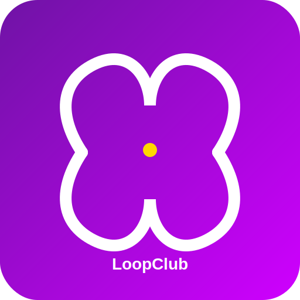
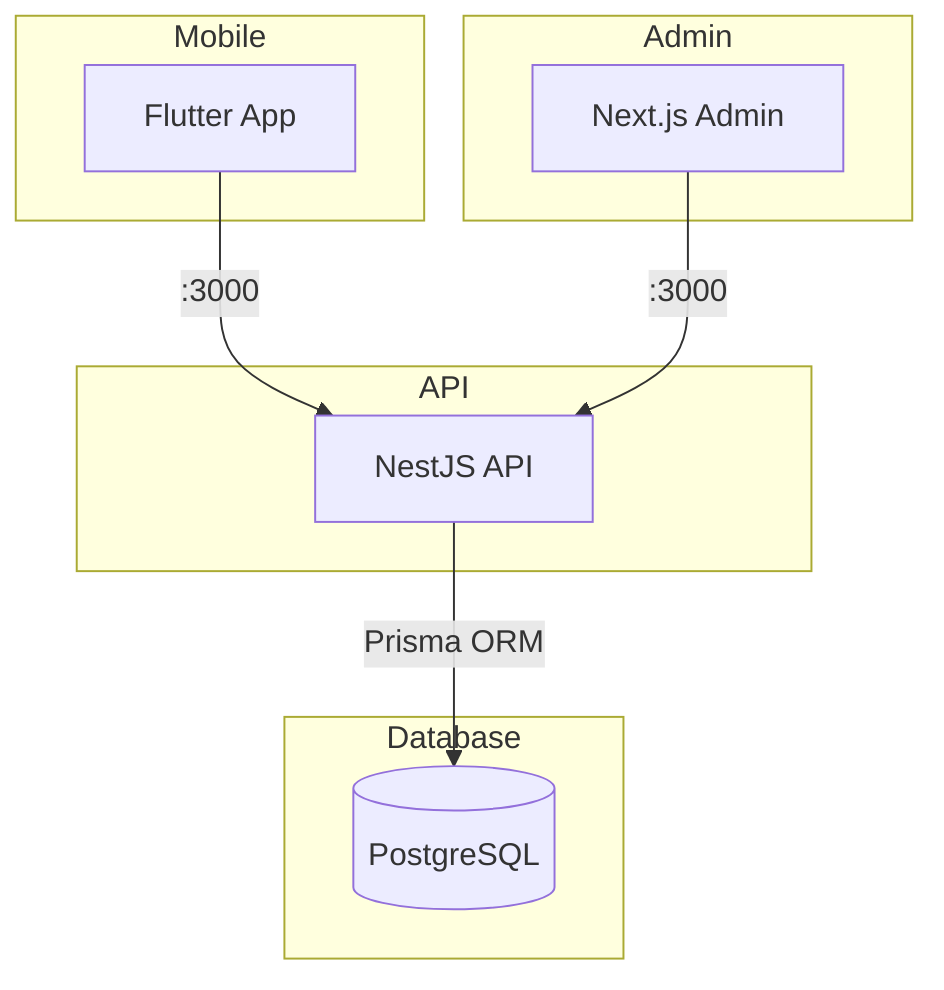

<p align="center">
  
</p>

<h1 align="center">LoopClub Enterprise</h1>

<p align="center">
  Plataforma SaaS multiempresa de fidelização, retenção e relacionamento com clientes.
</p>

<p align="center">
  <a href="docs/STATUS.md">Status</a> •
  <a href="docs/ROADMAP.md">Roadmap</a> •
  <a href="docs/API.md">API</a> •
  <a href="docs/SECURITY.md">Segurança</a> •
  <a href="docs/LGPD.md">LGPD</a> •
  <a href="docs/ARCHITECTURE.md">Arquitetura</a>
</p>

<p align="center">
  
  
  
  
  
  
</p>

<p align="center">
  
  
  
  
  
  
  
  
  
</p>

---

## Visão Geral

O LoopClub oferece um aplicativo único onde clientes acumulam pontos e trocam por recompensas, enquanto empresas gerenciam seus programas de fidelidade por um painel web centralizado. Uma única base de código atende clientes, funcionários, empresas e administração master.

> Projeto em desenvolvimento ativo. Consulte [STATUS.md](docs/STATUS.md) para detalhes.

---

## Principais Recursos

| Recurso | Status |
|---------|--------|
| Autenticação com JWT e RBAC | ✅ Implementado e validado |
| Gestão de empresas | ✅ Implementado |
| Gestão de usuários | ✅ Implementado |
| Helmet, CORS, hardening | ✅ Implementado e validado |
| App mobile (Flutter) | 🎨 Interface mockada |
| Admin web (Next.js) | 🎨 Interface mockada |
| Programas de fidelidade | 🗓️ Planejado |
| QR Code dinâmico | 🗓️ Planejado |
| Pagamentos e NFS-e | 🗓️ Planejado |
| Push notifications | 🗓️ Planejado |

---

## Perfis do Sistema

| Perfil | Acesso |
|--------|--------|
| **Admin** | Acesso global a empresas, usuários e assinaturas |
| **Company Owner** | Gerencia a própria empresa e programas |
| **Employee** | Opera o sistema da empresa (scanner, lançamentos) |
| **Client** | Acumula pontos e resgata recompensas |

---

## Preview

| Cliente | Empresa | Admin |
|---------|---------|-------|
| Carteira, progresso e QR Code | Scanner, clientes e métricas | Empresas, assinaturas e relatórios |
| _Preview será adicionado_ | _Preview será adicionado_ | _Preview será adicionado_ |

> Status atual: interfaces mockadas com dados fixos. Integração com API em planejamento.

---

## Arquitetura



Diagrama detalhado em [docs/ARCHITECTURE.md](docs/ARCHITECTURE.md).

---

## Stack Tecnológica

| Camada | Tecnologia |
|--------|-----------|
| Mobile | Flutter — Android e iOS |
| Backend | NestJS + TypeScript |
| ORM | Prisma |
| Banco | PostgreSQL 16 |
| Admin | Next.js |
| API | REST + Swagger / OpenAPI |
| Versionamento | Git + GitHub |
| Infra | Docker (PostgreSQL) |

---

## Estrutura do Projeto

```
loopclub_enterprise_sprint01/
├── apps/
│   ├── admin-web/         Next.js — painel admin
│   └── mobile/            Flutter — app multi-perfil
├── backend/               NestJS — API REST
│   ├── prisma/            Schema e migrações
│   └── src/modules/
│       ├── auth/          JWT, RBAC, guards
│       ├── companies/     CRUD, block/unblock
│       └── users/         Consulta de usuários
├── docs/                  Documentação viva
├── docker-compose.yml     PostgreSQL 16
└── backend/.env.example     Modelo de variáveis do backend
```

---

## Instalação

### Pré-requisitos

- Node.js >= 18, npm >= 9
- PostgreSQL 16 (local ou Docker)
- Flutter SDK >= 3.4.0 (opcional)
- Docker Desktop (opcional)

### Backend (API)

```powershell
git clone <repo-url>
cd loopclub_enterprise_sprint01/backend
npm install
Copy-Item .env.example .env
# Edite DATABASE_URL, JWT_SECRET e CORS_ORIGIN no .env
npx prisma generate
npx prisma migrate dev
npm run start:dev
```

### Admin Web

```powershell
cd apps/admin-web
npm install
npm run dev
```

### Mobile

```powershell
cd apps/mobile
flutter pub get
flutter run
```

> Guia completo em [docs/INSTALLATION.md](docs/INSTALLATION.md).

---

## Banco de Dados

- **Tecnologia:** PostgreSQL 16 via Prisma ORM
- **Schema:** 11 modelos, 6 enums
- **Infraestrutura:** Docker Compose incluso

```powershell
docker compose up -d postgres
npx prisma studio    # UI do banco em :5555
```

Detalhes em [docs/DATABASE.md](docs/DATABASE.md).

---

## Executando o Projeto

| Serviço | Comando | URL |
|---------|---------|-----|
| API | `cd backend && npm run start:dev` | http://localhost:3000 |
| Swagger | (mesmo servidor) | http://localhost:3000/docs |
| Admin | `cd apps/admin-web && npm run dev` | http://localhost:3001 |
| Mobile | `cd apps/mobile && flutter run` | Dispositivo/Emulador |
| Prisma Studio | `npx prisma studio` | http://localhost:5555 |

---

## API e Swagger

A API REST do LoopClub está documentada no Swagger em `/docs` quando o servidor estiver rodando.

**Autenticação:** JWT Bearer Token via header `Authorization: Bearer <token>`.

**Rotas públicas:** `GET /auth/health`, `POST /auth/register`, `POST /auth/login`.

**Rotas protegidas:** Exigem token JWT. Acesso控制ado por RBAC conforme o perfil.

| Rota | admin | company_owner | employee | client |
|------|-------|---------------|----------|--------|
| GET /users | ✅ | ❌ | ❌ | ❌ |
| GET /companies | ✅ | ✅ | ❌ | ❌ |
| POST /companies | ✅ | ❌ | ❌ | ❌ |
| PATCH /companies/:id/block | ✅ | ❌ | ❌ | ❌ |
| PATCH /companies/:id/unblock | ✅ | ❌ | ❌ | ❌ |

Detalhes completos em [docs/API.md](docs/API.md).

---

## Segurança e LGPD

O LoopClub adota privacy by design e security by design desde a concepção. A implementação dos controles está em evolução e a conformidade integral depende de implementação, auditoria e revisão jurídica.

### Documentos de segurança

| Documento | Conteúdo |
|-----------|----------|
| [SECURITY.md](docs/SECURITY.md) | Medidas de segurança e controles |
| [LGPD.md](docs/LGPD.md) | Adequação à Lei Geral de Proteção de Dados |
| [PRIVACY.md](docs/PRIVACY.md) | Princípios de privacidade do produto |
| [DATA-MAP.md](docs/DATA-MAP.md) | Mapa de dados pessoais e riscos |
| [THREAT-MODEL.md](docs/THREAT-MODEL.md) | Modelo de ameaças |
| [INCIDENT-RESPONSE.md](docs/INCIDENT-RESPONSE.md) | Plano de resposta a incidentes |
| [DATA-SUBJECT-RIGHTS.md](docs/DATA-SUBJECT-RIGHTS.md) | Direitos dos titulares LGPD |

### Boas práticas

- Nunca versionar `.env` ou arquivos com credenciais reais
- `.env.example` contém apenas valores fictícios
- Senhas armazenadas com hash bcrypt (10 rounds)
- Headers de segurança via Helmet ativos
- JWT com validação de assinatura, expiração e perfil
- CORS restritivo por ambiente

---

## Status do Desenvolvimento

| Item | Status |
|------|--------|
| Backend NestJS | ✅ Implementado e compilando |
| JWT Auth | ✅ Implementado e validado |
| RBAC (RolesGuard) | ✅ Implementado e validado |
| Helmet + CORS + x-powered-by | ✅ Implementado e validado |
| Swagger /docs | ✅ Implementado e validado |
| Auth register/login | ✅ Implementado e validado |
| App mobile Flutter | 🎨 Interface mockada |
| Admin web Next.js | 🎨 Interface mockada |
| Docker Compose | 🧩 Implementado, pendente de validação |
| Programas de fidelidade | 🗓️ Planejado |
| Pagamentos | 🗓️ Planejado |
| NFS-e | 🗓️ Planejado |
| Push notifications | 🗓️ Planejado |
| Isolamento multiempresa | 🗓️ Planejado |
| Refresh token | 🗓️ Planejado |

Detalhes em [docs/STATUS.md](docs/STATUS.md).

---

## Roadmap

| Sprint | Foco |
|--------|------|
| Sprint 01 | Fundação técnica, backend, auth, hardening ✅ |
| Sprint 02 | RBAC, refresh token, rate limiting 🔄 |
| Futuro | Fidelidade, QR Code, pagamentos, NFS-e, push, relatórios |

Detalhes em [docs/ROADMAP.md](docs/ROADMAP.md).

---

## Documentação

| Documento | Descrição |
|-----------|-----------|
| [STATUS.md](docs/STATUS.md) | Status detalhado de cada funcionalidade |
| [PRODUCT.md](docs/PRODUCT.md) | Visão do produto e personas |
| [ARCHITECTURE.md](docs/ARCHITECTURE.md) | Decisões e diagramas de arquitetura |
| [API.md](docs/API.md) | Endpoints da API |
| [DATABASE.md](docs/DATABASE.md) | Modelo de dados e entidades |
| [ROADMAP.md](docs/ROADMAP.md) | Roteiro completo do produto |
| [DECISIONS.md](docs/DECISIONS.md) | Registro de decisões arquiteturais (ADR) |
| [INSTALLATION.md](docs/INSTALLATION.md) | Guia completo de instalação |
| [DEVELOPMENT.md](docs/DEVELOPMENT.md) | Fluxo de desenvolvimento |
| [DEPLOYMENT.md](docs/DEPLOYMENT.md) | Deploy e CI/CD |
| [CONTRIBUTING.md](CONTRIBUTING.md) | Guia de contribuição |
| [CHANGELOG.md](CHANGELOG.md) | Histórico de versões |

---

## Contribuição

Consulte [CONTRIBUTING.md](CONTRIBUTING.md) para as regras de contribuição e [CLAUDE.md](CLAUDE.md) para instruções do ambiente de desenvolvimento.

---

## Licença

Código proprietário em desenvolvimento, publicado para fins de portfólio e demonstração técnica. Todos os direitos reservados à Nicholas Richardson Inácio da Silva, idealizador e desenvolvedor do sistema LoopClub Enterprise.
