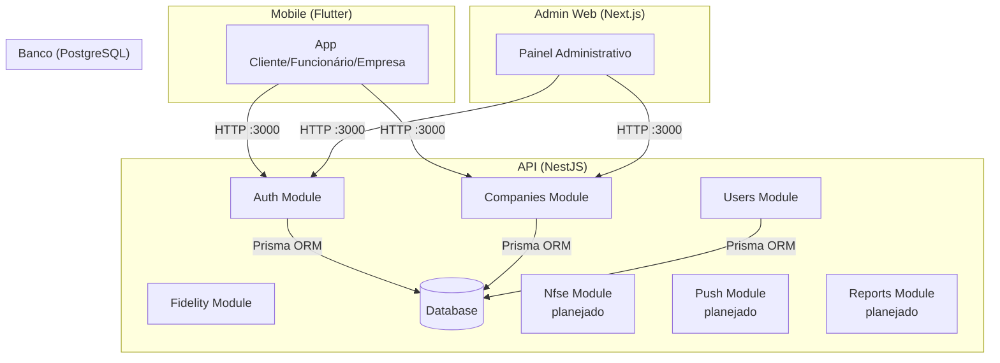

# Arquitetura do LoopClub Enterprise

## Visão geral

Monorepo com três frontends conectados a uma API REST central.



## Estrutura do monorepo

```
loopclub_enterprise_sprint01/
├── apps/
│   ├── admin-web/       # Next.js — painel do Admin Master
│   └── mobile/           # Flutter — app único multi-perfil
├── backend/              # NestJS — API REST
├── database/             # Scripts SQL auxiliares
├── docker/               # Configurações Docker
├── docs/                 # Documentação (inclui LGPD, privacidade, segurança)
├── infra/                # Configurações de infraestrutura
└── packages/             # Pacotes compartilhados (futuro)
```

## Backend (NestJS)

Estrutura modular com separação clara de responsabilidades:

- **Módulos:** cada domínio de negócio é um módulo independente
- **Controllers:** responsáveis apenas por receber requisições HTTP
- **Services:** contêm a lógica de negócio
- **DTOs:** validam e tipam dados de entrada
- **PrismaService:** camada única de acesso ao banco

### Módulos atuais e planejados

| Módulo | Status | Descrição |
|--------|--------|-----------|
| Auth | Implementado | Registro, login, JWT |
| Companies | Implementado | CRUD, block/unblock |
| Users | Implementado | Listagem de usuários |
| Fidelity | Planejado | Programas de fidelidade |
| Plans | Planejado | Gestão de planos |
| Dashboard | Planejado | Relatórios e métricas |
| Payments | Planejado | Pix, cartão, recorrência, webhooks, estorno |
| Nfse | Planejado | Emissão, status, cancelamento, provedor fiscal |
| PushNotifications | Planejado | Push global, por perfil/empresa, agendamento, opt-out |
| Reports | Planejado | Relatórios contábeis, exportação CSV/XLSX |

## Frontend Mobile (Flutter)

Arquitetura feature-first. Atualmente contém esqueleto visual com:

- Splash screen com identidade visual
- Tela de login
- Home da carteira do cliente com cards de fidelidade

## Frontend Admin (Next.js)

Dashboard administrativo com layout de sidebar. Atualmente contém:

- Cards de métricas (MRR previsto, empresas ativas, etc.)
- Tabela de empresas recentes (dados mockados)
- Navegação lateral com seções planejadas

## Multi-tenancy

O isolamento entre empresas é feito por `companyId`. Cada registro sensível (progresso, transações, programas) referencia a empresa proprietária. Consultas devem sempre filtrar por `companyId` para evitar vazamento de dados entre tenants.

### Fonte oficial de vínculo

O vínculo entre usuário e empresa é estabelecido exclusivamente pela tabela `CompanyUser` (N:N). Não há `companyId` diretamente no model `User` nem no payload do JWT.

### Fluxo de autorização com tenant

```
Requisição HTTP
  ↓
[1] JwtAuthGuard — autenticação
     Valida JWT, extrai sub e role para request.user
  ↓
[2] RolesGuard — autorização global (RBAC)
     Verifica user.role contra @Roles() da rota
     Sem consulta ao banco
  ↓
[3] TenantGuard — somente em rotas com @RequireCompany()
     Lê metadata do decorator
     Se rota exige tenant → TenantService.resolveTenant():
       ├─ admin → null (sem companyId obrigatório)
       ├─ company_owner/employee →
       │    ├─ 0 CompanyUser ativo → 403
       │    ├─ 2+ CompanyUser ativos → 403 + log interno
       │    ├─ 1 vínculo + empresa inativa → 403
       │    ├─ 1 vínculo + incoerência de papéis → 403
       │    └─ 1 vínculo válido → injeta companyId + companyRole
       └─ client → não chega (bloqueado pelo RolesGuard)
     Se rota não exige tenant → não consulta banco
  ↓
[4] Controller → Service
     Usa request.user.companyId para filtrar/queries
     Nunca confia em companyId vindo do body, query ou params
```

### Responsabilidades das camadas

| Camada | Guard/Service | Responsabilidade |
|--------|---------------|------------------|
| Autenticação | `JwtAuthGuard` + `JwtStrategy` | Validar JWT, extrair sub/role. Apenas `{ userId, role }` no request.user. |
| Autorização global | `RolesGuard` | Verificar user.role contra perfis permitidos pela rota. Sem consulta ao banco. |
| Contexto empresarial | `TenantGuard` + `TenantService` | Consultar CompanyUser ativo, validar empresa, validar coerência, injetar companyId/companyRole. Só ativo se a rota tiver `@RequireCompany()`. |
| Filtro de dados | Service | Filtrar consultas pelo companyId validado (request.user.companyId). |

### Regras do MVP

- No máximo um vínculo empresarial ativo por usuário.
- Usuário sem vínculo ativo recebe 403 em rotas empresariais.
- Usuário com múltiplos vínculos ativos recebe erro controlado (sem escolher empresa automaticamente).
- Admin global não exige companyId — acesso irrestrito a dados de todas as empresas.
- CompanyId nunca vem do JWT, do body, da query ou de parâmetros de rota. Vem exclusivamente do contexto autenticado e validado.
- Recursos de outro tenant retornam preferencialmente 404 (em rotas com identificador, futuras).

> **Implementado:** primeira camada de isolamento aplicada ao GET /companies. Infraestrutura reutilizável (TenantModule, TenantService, TenantGuard) disponível para demais módulos. **Pendente:** estender para demais rotas e módulos, AuditLog para inconsistências, permissões para CompanyUserRole.manager, cache de tenant.

## Arquitetura de segurança (atual vs. planejada)

```mermaid
graph TB
    subgraph "Camada de Apresentação"
        REQ[Requisição HTTP]
    end

    subgraph "Camada de Autenticação"
        JWT_GUARD[JwtAuthGuard<br/>valida token JWT]
        PUBLIC[Decorator @Public()<br/>marca rotas públicas]
    end

    subgraph "Camada de Autorização Global"
        RBAC[RolesGuard<br/>valida perfil do usuário]
    end

    subgraph "Camada de Contexto Empresarial"
        TENANT_GUARD[TenantGuard<br/>ativa se @RequireCompany()]
        TENANT_SVC[TenantService<br/>consulta CompanyUser<br/>valida vínculo e empresa<br/>injeta companyId]
    end

    subgraph "Camada de Segurança — Planejada"
        RATE[Rate Limiter]
    end

    subgraph "Camada de Negócio"
        CTRL[Controller]
        SRV[Service<br/>filtra por companyId]
        AUDIT[AuditLog]
    end

    subgraph "Camada de Dados"
        PRISMA[Prisma ORM]
        DB[(PostgreSQL)]
    end

    REQ --> JWT_GUARD
    JWT_GUARD -->|rota pública| CTRL
    JWT_GUARD -->|rota protegida| RBAC
    RBAC -->|sem permissão| FIM1[HTTP 403]
    RBAC -->|autorizado| TENANT_GUARD
    TENANT_GUARD -->|rota sem @RequireCompany| CTRL
    TENANT_GUARD -->|rota empresarial| TENANT_SVC
    TENANT_SVC -->|0 vínculos / múltiplos / incoerente| FIM2[HTTP 403]
    TENANT_SVC -->|vínculo válido<br/>+ empresa ativa| CTRL
    CTRL --> SRV
    SRV --> AUDIT
    SRV --> PRISMA
    PRISMA --> DB
```

### Fluxo atual de autorização

1. Requisição chega com (ou sem) JWT no header `Authorization`
2. `JwtAuthGuard` verifica se a rota possui `@Public()` — se sim, libera sem validar token
3. Se não for pública, `JwtStrategy` valida assinatura, expiração e payload (`sub`, `role`)
4. Token inválido, ausente ou expirado → HTTP 401
5. Token válido → `{ userId, role }` no `request.user`
6. `RolesGuard` verifica `user.role` contra os perfis permitidos pela rota → 403 se sem permissão
7. Se a rota possui `@RequireCompany()`, `TenantGuard` ativa `TenantService.resolveTenant()`:
   - Admin → sem companyId (acesso global)
   - Company_owner/employee → busca CompanyUser ativo, valida empresa, injeta `companyId` + `companyRole`
   - Zero/múltiplos vínculos → 403
8. Controller e Service usam `request.user.companyId` para filtrar dados
9. Rotas públicas: `GET /auth/health`, `POST /auth/register`, `POST /auth/login`

> **Implementado:** JWT AuthGuard com `@Public()`, RolesGuard com `@Roles()` (admin, company_owner, employee, client), TenantGuard com `@RequireCompany()`, TenantService com validação de CompanyUser e coerência de papéis. **Pendente:** rate limiting, audit log, estender tenant isolation para demais módulos. **Planejado:** módulo Payments (gateway desacoplado), Nfse (provedor fiscal substituível), PushNotifications (auditável), Reports (exportação contábil).

## Padrões brasileiros — requisito transversal

O LoopClub Enterprise é desenvolvido exclusivamente para o mercado brasileiro. As decisões arquiteturais abaixo refletem esse compromisso:

- **Idioma:** pt-BR em todas as interfaces de usuário, e-mails, SMS, push notifications e documentos gerados. Código-fonte e logs internos podem usar inglês técnico.
- **Moeda:** Real (R$). Armazenamento em `Decimal` ou centavos. Formatação pt-BR na apresentação.
- **Datas:** ISO 8601 em APIs e armazenamento (UTC). Conversão para America/Recife na exibição. Nunca armazenar DD/MM/AAAA no banco.
- **Documentos fiscais:** CPF (11 dígitos), CNPJ (14 dígitos). Armazenar apenas números. Validar dígitos verificadores. Máscara na interface.
- **Telefones:** Padrão brasileiro com DDD. Armazenar normalizado (apenas números). E.164 para integrações externas.
- **CEP:** 8 dígitos. Armazenar apenas números. Preparar integração ViaCEP.
- **Endereço:** Logradouro, número, complemento, bairro, município, UF, CEP — modelo brasileiro.

> Consulte [PRODUCT.md](PRODUCT.md) para a especificação completa dos padrões brasileiros e [DECISIONS.md](DECISIONS.md) (ADR-017) para a decisão arquitetural.

## Estratégia de testes

### Testes unitários
- Ficam próximos aos módulos testados (`src/modules/*/*.spec.ts`).
- Usam mocks do PrismaService — não acessam banco de dados.
- Cobertura: TenantService (100%), TenantGuard (100%), CompaniesService.findAll (parcial).
- Jest com ts-jest, configurado via `jest.config.cjs` e `tsconfig.spec.json`.

### Testes e2e (pendentes)
- Ficarão em `backend/test/`.
- Exigirão Supertest, banco PostgreSQL exclusivo e seed dedicado.
- Validarão o fluxo HTTP completo: autenticação → autorização → tenant isolation.

### Regras
- O banco de desenvolvimento nunca deve ser usado nos testes automatizados.
- `backend/coverage/` é artefato local e está ignorado pelo `.gitignore`.
- Arquivos `.spec.ts` não entram no build de produção.

## Documentos de arquitetura relacionados

- [LGPD.md](LGPD.md) — Adequação à LGPD e privacy by design
- [PRIVACY.md](PRIVACY.md) — Princípios de privacidade do produto
- [SECURITY.md](SECURITY.md) — Medidas de segurança
- [THREAT-MODEL.md](THREAT-MODEL.md) — Modelo de ameaças
- [DATA-MAP.md](DATA-MAP.md) — Mapa de dados pessoais
