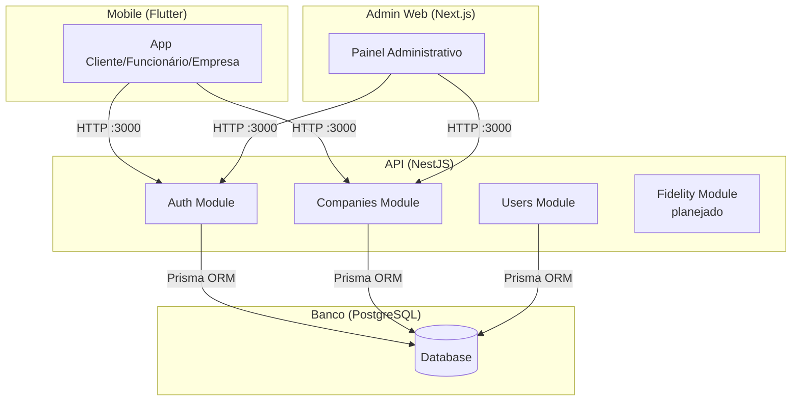
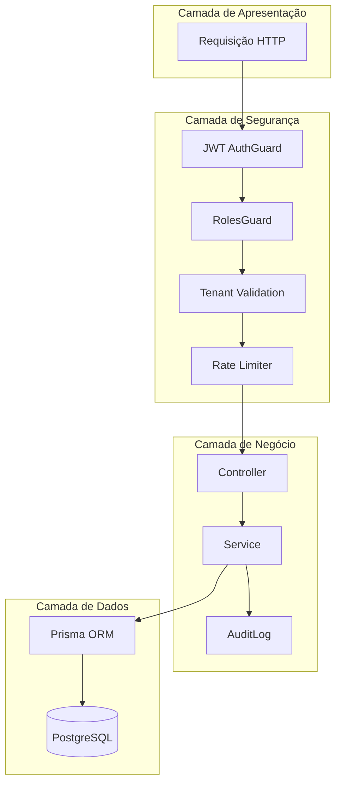

# Arquitetura do LoopClub Enterprise

## Visão geral

Monorepo com três frontends conectados a uma API REST central.



## Estrutura do monorepo

```
loopclub_enterprise_sprint01/
├── apps/
│   ├── admin-web/       # Next.js — painel do Admin Master
│   └── mobile/           # Flutter — app único multi-perfil
├── backend/              # NestJS — API REST
├── database/             # Scripts SQL auxiliares
├── docker/               # Configurações Docker
├── docs/                 # Documentação (inclui LGPD, privacidade, segurança)
├── infra/                # Configurações de infraestrutura
└── packages/             # Pacotes compartilhados (futuro)
```

## Backend (NestJS)

Estrutura modular com separação clara de responsabilidades:

- **Módulos:** cada domínio de negócio é um módulo independente
- **Controllers:** responsáveis apenas por receber requisições HTTP
- **Services:** contêm a lógica de negócio
- **DTOs:** validam e tipam dados de entrada
- **PrismaService:** camada única de acesso ao banco

### Módulos atuais

| Módulo | Status | Descrição |
|--------|--------|-----------|
| Auth | Implementado | Registro, login, JWT |
| Companies | Implementado | CRUD, block/unblock |
| Users | Implementado | Listagem de usuários |
| Fidelity | Planejado | Programas de fidelidade |
| Plans | Planejado | Gestão de planos |
| Dashboard | Planejado | Relatórios e métricas |

## Frontend Mobile (Flutter)

Arquitetura feature-first. Atualmente contém esqueleto visual com:

- Splash screen com identidade visual
- Tela de login
- Home da carteira do cliente com cards de fidelidade

## Frontend Admin (Next.js)

Dashboard administrativo com layout de sidebar. Atualmente contém:

- Cards de métricas (MRR previsto, empresas ativas, etc.)
- Tabela de empresas recentes (dados mockados)
- Navegação lateral com seções planejadas

## Multi-tenancy

O isolamento entre empresas é feito por `companyId`. Cada registro sensível (progresso, transações, programas) referencia a empresa proprietária. Consultas devem sempre filtrar por `companyId` para evitar vazamento de dados entre tenants.

> **Aviso:** A validação de tenant isolation ainda não está implementada. Nenhum endpoint atual verifica se o usuário pertence à empresa que está acessando.

## Arquitetura de segurança (planejada)



### Fluxo futuro de autorização

1. Requisição chega com JWT no header `Authorization`
2. `AuthGuard` valida o token e extrai `userId` e `role`
3. `RolesGuard` verifica se o perfil tem permissão para a rota
4. Camada de serviço valida `companyId` contra o token
5. Ação é registrada no `AuditLog` se for uma operação crítica
6. Dados retornados são filtrados conforme o perfil (não expor dados de outros tenants)

> **Pendência:** As camadas JWT, RBAC e Tenant estão planejadas mas não implementadas.

## Documentos de arquitetura relacionados

- [LGPD.md](LGPD.md) — Adequação à LGPD e privacy by design
- [PRIVACY.md](PRIVACY.md) — Princípios de privacidade do produto
- [SECURITY.md](SECURITY.md) — Medidas de segurança
- [THREAT-MODEL.md](THREAT-MODEL.md) — Modelo de ameaças
- [DATA-MAP.md](DATA-MAP.md) — Mapa de dados pessoais
