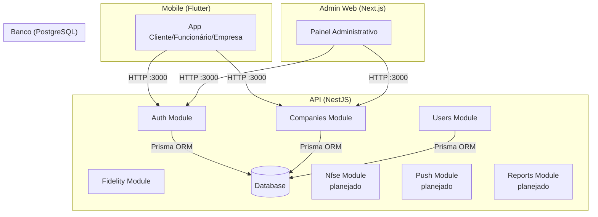

# Arquitetura do LoopClub Enterprise

## Visão geral

Monorepo com três frontends conectados a uma API REST central.



## Estrutura do monorepo

```
loopclub_enterprise_sprint01/
├── apps/
│   ├── admin-web/       # Next.js — painel do Admin Master
│   └── mobile/           # Flutter — app único multi-perfil
├── backend/              # NestJS — API REST
├── database/             # Scripts SQL auxiliares
├── docker/               # Configurações Docker
├── docs/                 # Documentação (inclui LGPD, privacidade, segurança)
├── infra/                # Configurações de infraestrutura
└── packages/             # Pacotes compartilhados (futuro)
```

## Backend (NestJS)

Estrutura modular com separação clara de responsabilidades:

- **Módulos:** cada domínio de negócio é um módulo independente
- **Controllers:** responsáveis apenas por receber requisições HTTP
- **Services:** contêm a lógica de negócio
- **DTOs:** validam e tipam dados de entrada
- **PrismaService:** camada única de acesso ao banco

### Módulos atuais e planejados

| Módulo | Status | Descrição |
|--------|--------|-----------|
| Auth | Implementado | Registro, login, JWT |
| Companies | Implementado | CRUD, block/unblock |
| Users | Implementado | Listagem de usuários |
| Fidelity | Planejado | Programas de fidelidade |
| Plans | Planejado | Gestão de planos |
| Dashboard | Planejado | Relatórios e métricas |
| Payments | Planejado | Pix, cartão, recorrência, webhooks, estorno |
| Nfse | Planejado | Emissão, status, cancelamento, provedor fiscal |
| PushNotifications | Planejado | Push global, por perfil/empresa, agendamento, opt-out |
| Reports | Planejado | Relatórios contábeis, exportação CSV/XLSX |

## Frontend Mobile (Flutter)

Arquitetura feature-first. Atualmente contém esqueleto visual com:

- Splash screen com identidade visual
- Tela de login
- Home da carteira do cliente com cards de fidelidade

## Frontend Admin (Next.js)

Dashboard administrativo com layout de sidebar. Atualmente contém:

- Cards de métricas (MRR previsto, empresas ativas, etc.)
- Tabela de empresas recentes (dados mockados)
- Navegação lateral com seções planejadas

## Multi-tenancy

O isolamento entre empresas é feito por `companyId`. Cada registro sensível (progresso, transações, programas) referencia a empresa proprietária. Consultas devem sempre filtrar por `companyId` para evitar vazamento de dados entre tenants.

> **Aviso:** A validação de tenant isolation ainda não está implementada. Nenhum endpoint atual verifica se o usuário pertence à empresa que está acessando.

## Arquitetura de segurança (atual vs. planejada)

```mermaid
graph TB
    subgraph "Camada de Apresentação"
        REQ[Requisição HTTP]
    end

    subgraph "Camada de Segurança — Implementada"
        JWT_GUARD[JwtAuthGuard<br/>valida token JWT]
        PUBLIC[Decorator @Public()<br/>marca rotas públicas]
    end

    subgraph "Camada de Segurança — Implementada"
        RBAC[RolesGuard<br/>valida perfil do usuário]
    end

    subgraph "Camada de Segurança — Planejada"
        TENANT[Tenant Validation]
        RATE[Rate Limiter]
    end

    subgraph "Camada de Negócio"
        CTRL[Controller]
        SRV[Service]
        AUDIT[AuditLog]
    end

    subgraph "Camada de Dados"
        PRISMA[Prisma ORM]
        DB[(PostgreSQL)]
    end

    REQ --> JWT_GUARD
    JWT_GUARD -->|rota pública| CTRL
    JWT_GUARD -->|rota protegida| RBAC
    RBAC -->|autorizado| CTRL
    RBAC -->|sem permissão| FIM[HTTP 403]
    CTRL --> SRV
    CTRL --> SRV
    SRV --> AUDIT
    SRV --> PRISMA
    PRISMA --> DB
```

### Fluxo atual de autorização

1. Requisição chega com (ou sem) JWT no header `Authorization`
2. `JwtAuthGuard` verifica se a rota possui `@Public()` — se sim, libera sem validar token
3. Se não for pública, `JwtStrategy` valida assinatura, expiração e payload (`sub`, `role`)
4. Token inválido, ausente ou expirado → HTTP 401
5. Token válido → `userId` e `role` disponíveis no `request.user` para o controller
6. Rotas públicas: `GET /auth/health`, `POST /auth/register`, `POST /auth/login`

> **Implementado:** JWT AuthGuard com `@Public()`, RolesGuard com `@Roles()` (admin, company_owner, employee, client). **Pendente:** validação de tenant, rate limiting, audit log. **Planejado:** módulo Payments (gateway desacoplado), Nfse (provedor fiscal substituível), PushNotifications (auditável), Reports (exportação contábil).

## Padrões brasileiros — requisito transversal

O LoopClub Enterprise é desenvolvido exclusivamente para o mercado brasileiro. As decisões arquiteturais abaixo refletem esse compromisso:

- **Idioma:** pt-BR em todas as interfaces de usuário, e-mails, SMS, push notifications e documentos gerados. Código-fonte e logs internos podem usar inglês técnico.
- **Moeda:** Real (R$). Armazenamento em `Decimal` ou centavos. Formatação pt-BR na apresentação.
- **Datas:** ISO 8601 em APIs e armazenamento (UTC). Conversão para America/Recife na exibição. Nunca armazenar DD/MM/AAAA no banco.
- **Documentos fiscais:** CPF (11 dígitos), CNPJ (14 dígitos). Armazenar apenas números. Validar dígitos verificadores. Máscara na interface.
- **Telefones:** Padrão brasileiro com DDD. Armazenar normalizado (apenas números). E.164 para integrações externas.
- **CEP:** 8 dígitos. Armazenar apenas números. Preparar integração ViaCEP.
- **Endereço:** Logradouro, número, complemento, bairro, município, UF, CEP — modelo brasileiro.

> Consulte [PRODUCT.md](PRODUCT.md) para a especificação completa dos padrões brasileiros e [DECISIONS.md](DECISIONS.md) (ADR-017) para a decisão arquitetural.

## Documentos de arquitetura relacionados

- [LGPD.md](LGPD.md) — Adequação à LGPD e privacy by design
- [PRIVACY.md](PRIVACY.md) — Princípios de privacidade do produto
- [SECURITY.md](SECURITY.md) — Medidas de segurança
- [THREAT-MODEL.md](THREAT-MODEL.md) — Modelo de ameaças
- [DATA-MAP.md](DATA-MAP.md) — Mapa de dados pessoais
