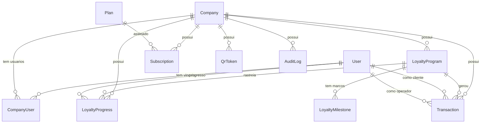

# Banco de Dados

## Tecnologia

- PostgreSQL 16
- Prisma ORM 5.x
- Acesso via Prisma Client no NestJS

## Schema atual

O schema completo está em [`backend/prisma/schema.prisma`](../backend/prisma/schema.prisma).

## Enums

| Enum | Valores |
|------|---------|
| UserRole | admin, company_owner, employee, client |
| UserStatus | active, blocked, deleted |
| CompanyStatus | active, blocked, trial, canceled |
| CompanyUserRole | owner, manager, employee |
| LoyaltyProgramType | buy_x_get_y, progressive |
| TransactionType | qr_point, manual_point, remove_point, reset, reward_redeemed |

## Entidades

### User

Usuário do sistema. Pode ser admin, empresa, funcionário ou cliente.

| Campo | Tipo | Descrição |
|-------|------|-----------|
| id | UUID | Chave primária |
| name | String | Nome completo |
| phone | String? | Telefone (único) |
| email | String? | E-mail (único) |
| passwordHash | String? | Hash bcrypt da senha |
| role | UserRole | admin, company_owner, employee, client |
| status | UserStatus | active, blocked, deleted |

### Company

Empresa cliente da plataforma.

| Campo | Tipo | Descrição |
|-------|------|-----------|
| id | UUID | Chave primária |
| name | String | Nome fantasia |
| document | String? | CNPJ/CPF (único) |
| category | String | Ex.: "acai", "restaurante", "barbearia" |
| phone | String? | Telefone de contato |
| email | String? | E-mail de contato |
| ownerName | String? | Nome do proprietário |
| status | CompanyStatus | active, blocked, trial, canceled |
| logoUrl | String? | URL da logo |
| primaryColor | String | Cor primária (#6F13A5) |
| secondaryColor | String | Cor secundária (#CF00FF) |

### CompanyUser

Vínculo entre usuário e empresa.

| Campo | Tipo | Descrição |
|-------|------|-----------|
| id | UUID | Chave primária |
| companyId | UUID | FK → Company |
| userId | UUID | FK → User |
| role | CompanyUserRole | owner, manager, employee |
| status | UserStatus | active, blocked, deleted |

**Restrição:** único por par (companyId, userId).

### Plan

Planos de assinatura disponíveis.

| Campo | Tipo | Descrição |
|-------|------|-----------|
| id | UUID | Chave primária |
| name | String | Nome do plano |
| price | Decimal | Preço mensal |
| maxClients | Int? | Limite de clientes |
| maxPrograms | Int? | Limite de programas |
| features | JSON? | Features habilitadas |

### Subscription

Assinatura de uma empresa a um plano.

| Campo | Tipo | Descrição |
|-------|------|-----------|
| id | UUID | Chave primária |
| companyId | UUID | FK → Company |
| planId | UUID | FK → Plan |
| price | Decimal | Preço contratado |
| status | String | active, canceled, overdue |
| dueDate | DateTime? | Próximo vencimento |
| paidUntil | DateTime? | Pago até |

### LoyaltyProgram

Programa de fidelidade de uma empresa.

| Campo | Tipo | Descrição |
|-------|------|-----------|
| id | UUID | Chave primária |
| companyId | UUID | FK → Company |
| name | String | Nome do programa |
| type | LoyaltyProgramType | buy_x_get_y, progressive |
| targetPoints | Int | Pontos alvo |
| rewardName | String | Nome da recompensa |

### LoyaltyMilestone

Marcos de programas progressivos (múltiplas recompensas).

| Campo | Tipo | Descrição |
|-------|------|-----------|
| id | UUID | Chave primária |
| programId | UUID | FK → LoyaltyProgram |
| pointsRequired | Int | Pontos necessários |
| rewardName | String | Recompensa deste marco |

### LoyaltyProgress

Progresso individual do cliente em um programa.

| Campo | Tipo | Descrição |
|-------|------|-----------|
| id | UUID | Chave primária |
| companyId | UUID | FK → Company |
| programId | UUID | FK → LoyaltyProgram |
| clientId | UUID | FK → User (client) |
| currentPoints | Int | Pontos acumulados |
| completedCycles | Int | Ciclos completados |

**Restrição:** único por par (programId, clientId).

### Transaction

Transação de pontos (lançamento, resgate, etc.).

| Campo | Tipo | Descrição |
|-------|------|-----------|
| id | UUID | Chave primária |
| companyId | UUID | FK → Company |
| programId | UUID? | FK → LoyaltyProgram |
| clientId | UUID | FK → User (client) |
| operatorId | UUID? | FK → User (employee/admin) |
| type | TransactionType | qr_point, manual_point, remove_point, reset, reward_redeemed |
| points | Int | Quantidade de pontos |
| description | String? | Observação |

### QrToken

Token QR Code dinâmico para identificação do cliente.

| Campo | Tipo | Descrição |
|-------|------|-----------|
| id | UUID | Chave primária |
| companyId | UUID | FK → Company |
| clientId | UUID | FK → User |
| tokenHash | String | Hash do token (único) |
| expiresAt | DateTime | Data de expiração |
| usedAt | DateTime? | Quando foi usado |

### AuditLog

Auditoria de ações no sistema.

| Campo | Tipo | Descrição |
|-------|------|-----------|
| id | UUID | Chave primária |
| userId | UUID? | Quem executou |
| companyId | UUID? | Empresa afetada |
| action | String | Ação executada |
| entity | String | Entidade alvo |
| entityId | String? | ID da entidade |
| metadata | JSON? | Dados adicionais |

## Entidades propostas (LGPD e segurança)

As entidades abaixo são planejadas para conformidade com LGPD e segurança. Não fazem parte do schema atual e devem ser implementadas conforme necessário.

| Entidade | Finalidade | Prioridade |
|----------|-----------|------------|
| `PrivacyPolicyVersion` | Versionamento das políticas de privacidade | Média |
| `TermsVersion` | Versionamento dos termos de uso | Média |
| `UserConsent` | Registro de consentimento do usuário (base legal) | Alta |
| `DataSubjectRequest` | Registro de solicitações de titulares (LGPD art. 18) | Alta |
| `SecurityIncident` | Registro de incidentes de segurança | Alta |
| `RefreshToken` | Armazenamento de refresh tokens com revogação | Alta |
| `Session` | Controle de sessões ativas por usuário | Média |
| `DataRetentionJob` | Job programado para execução da política de retenção | Média |

> **Nota:** Essas entidades são propostas e não devem ser implementadas sem análise de impacto e validação da arquitetura.

## Diagrama de relacionamentos

## Observações

- Todas as chaves primárias usam UUID
- Timestamps automáticos com `@default(now())` e `@updatedAt`
- Índices criados nas FKs e campos de busca frequente (companyId, clientId, createdAt)
- Multi-tenancy por `companyId` — toda consulta deve filtrar pela empresa
